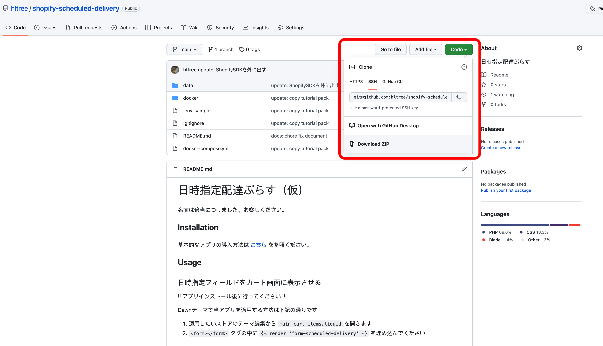
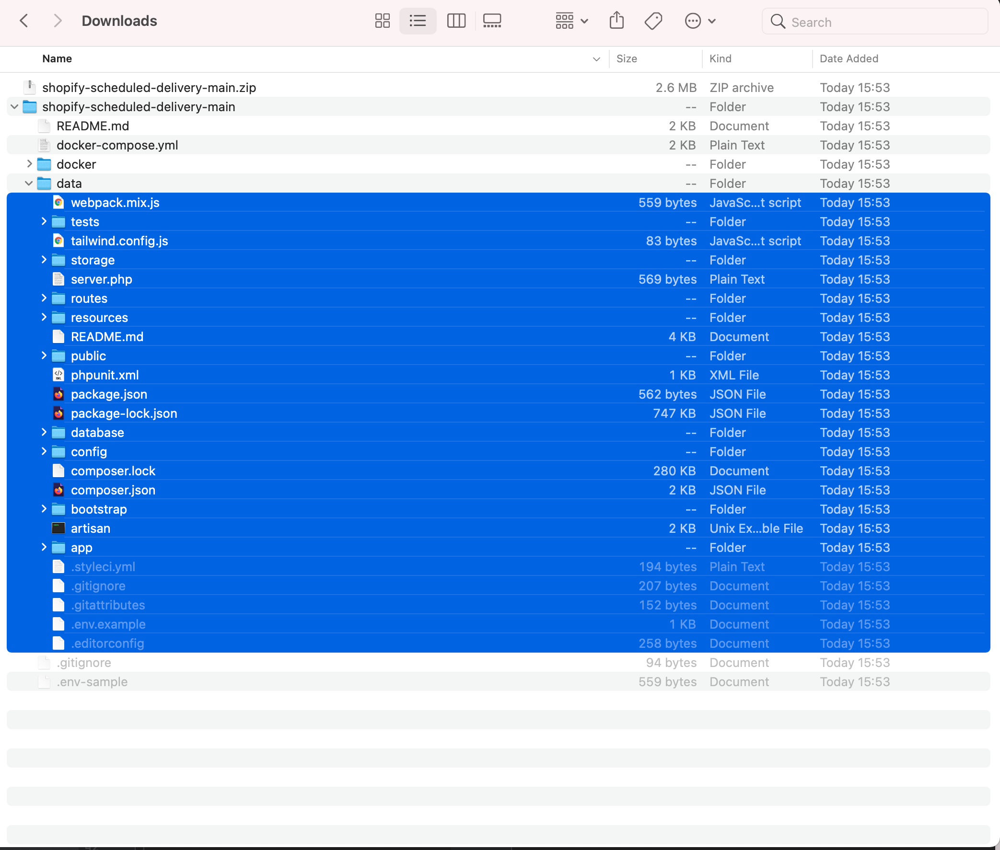

# Installation

1. 当アプリをGitからダウンロードする

[Gitページ](https://github.com/hltree/shopify-scheduled-delivery) を開いて、Zipダウンロードしてください（緑のタブを押して、Download Zipをクリック！）

2. Zipを解凍してdata以下のファイルを用意したサーバーにアップロードする

青く塗られているファイルおよびフォルダを全てアップロードしてください！

※不可視ファイル（通常は見えないファイル）のアップロード忘れにご注意ください

3. ストア管理画面にアクセスし、アプリを作成する

「Develop apps for your store」をクリックします。

「Create an app」をクリックします。

「App name」と「App developer」を設定するポップアップが出ますので、

「App name」にはご自由に名前を（管理しやすい名前にすることをオススメします！）、
「App developer」には選択できるアドレスを適当に指定してください。

